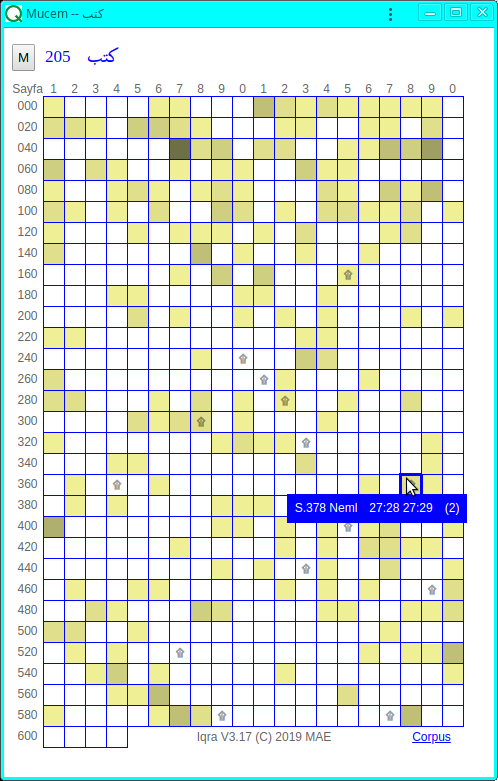

## Iqra V3.17

Iqra3, Kerim Kitabımız Kuran'ı okumak için yapılan yüzlerce yazılımdan biridir.

### 1. Sayfayı açmak ve çevirmek
Yazılımı başlatmak için üç farklı türden adres verebiliriz:

* [https://maeyler.github.io/Iqra3/reader](https://maeyler.github.io/Iqra3/reader) (yalın -- son kaldığı yerden devam eder)
* [https://maeyler.github.io/Iqra3/reader#p=378](https://maeyler.github.io/Iqra3/reader#p=378) (numarası verilen sayfadan)
* [https://maeyler.github.io/Iqra3/reader#v=27:28](https://maeyler.github.io/Iqra3/reader#v=27:28) (27. surenin 28. ayetinden)

Ekran yeteri kadar geniş ise hem Kuran sayfası hem de meali görünür. Sayfa açılınca, sonraki ya da önceki sayfaya geçmek, başka bir sure ya da sayfa numarası vermek mümkün. Sağ üstte görünen tuşların anlamı:

* T - Meal göster/gizle (sadece dar ekranda)
* … - Aynı sayfayı dış kaynaklarda aç
* \+ - Geçici bir büyüteç göster/gizle
* K - Arapça kelime köklerini göster/gizle

Sayfanın adresinde yazılan numaradan sonra, `&r=ktb` şeklinde kelime kökleri verilirse, bu kelimeler renkli gösterilir. Mucem'de seçilen kelimeler bu şekilde renklendiriliyor.


Bu ekranı görmek için gereken adres: [https://maeyler.github.io/Iqra3/reader#v=27:28&r=ktb](https://maeyler.github.io/Iqra3/reader#v=27:28&r=ktb)

Dar ekranlarda, ayetin anlamını görmek için T tuşuna basmak gerekiyor. Fontlar ekran genişliği ile orantılı olduğundan, telefonu yan tutmak daha iyi görüntü verecektir.


### 2. Arama motorları
Yazılım üç türlü aramayı destekliyor:

1. Düz metin ara (üç dilde)
2. Arapça kelimenin kökü ile ara
3. Ayete kelime bazında benzeyen ayetleri ara

### 2.1 Finder (Üç dil)
Arapça metin ya da meal içinde düz metin aramak için A. Rajab tarafından bitirme proje olarak hazırlanıyor (Bitiş tarihi: 2020 Mayıs)


Arapça-Türkçe-İngilizce sesli arama özelliği eklendi (Ayrıntılar ilgili sayfada açıklanacak)


### 2.2 Mucem (sadece Arapça)
Seçilen Arapça kelimelerin köküne bağlı bu arama yöntemi Kuran dilini bilenler ya da öğrenmek isteyenler için tasarlandı. Bu sayfada görülen 604 kutunun herbiri Kuran'dan bir sayfa. Aranan kök beyaz sayfalarda hiç yok. Her kutunun rengi, ilgili sayfada bulunan kelime sayısı ile orantılı.


**Ayrıntılar [ilgili sayfada](guideM.md)**

### 2.3 Benzer ayetler
(Bu kısım henüz yapılmadı)


### 3. Yazılımın yetenekleri
PWA (web application) olduğu için taşıdığı özellikler:

* Web sayfasından açılınca bileşenleri otomatik indirilir
* Güncelleme gerekmez, yeni sürümler otomatik indirilir
* Bir uygulama gibi, kendi penceresinde açılabilir
* Internet bağlantısı olmadan off-line çalışabilir
* Masa-üstü ekranlarından telefona kadar her boya uyumludur

Yazılımı üç pencere aynı anda açık iken kullanmayı tavsiye ediyoruz. Geniş ekranlarda mouse ile, dar ekranlarda adres çubuğunu kaydırarak pencereler arası geçiş sağlanıyor. Aşağıdaki üç pencere üstünde yazılımın yeteneklerini özetleyelim:


* Mucem: Gösterilen **ktb** (kef-tâ-bâ) kökünün muhtelif türevleri 319 kere, 205 sayfada geçiyor. Resimde seçilen 378. sayfada iki kere, daha koyu sayfalarda ise daha çok geçiyor. Arama konusu ayetleri, mavi alana tıklayarak Iqra'da, harflere tıklayarak dış kaynaklarda okuyabiliriz. Sağ alt köşedeki Corpus linkinden kullandığımız referans sayfaya ulaşılır.

* Iqra: Açık olan 378. sayfada "bismillah" kelimesi seçilmiş. K tuşu renkli olduğundan, imleçin üstünde olduğu kelimenin kökü **smw** (sin-mim-vav) görülüyor. Ayrıca, bağlam menüsünden üç türlü arama motoruna geçilebilir: M - Mucem, F - Finder, B - Benzer.

* Finder: Resimde "bismillah" harf dizisinin bulunduğu üç ayet görülüyor. Ayet numarasına basarak Iqra'ya dönmek ya da menüden dış yazılıma geçmek mümkün.


### 4. Yazılımın tarihçesi
* V1. Iqra projesi 1992'de (henüz web yok iken) başladı. Basit bir DOS programı olan Salsabil'den Arapça metin, Diyanet mealinden Türkçe metin kullandık. (Easy View: Think Pascal'da yazıldı, sadece Mac OS altında çalışıyordu)

* V2. Yazılımın Windows'a çevrilmesi çok başarılı değildi. Mac altında çalışan bir çok özelliği taşımak mümkün olmadı. (Turbo Pascal -- 1998)

* V3.0 Quranic Arabic Corpus çıkınca, bütün masa-üstü ve diz-üstü sistemlerde çalışan ilk sürümü geliştirdik. (Java -- 2012)

* V3.05 [jar file](https://github.com/maeyler/Iqra3/blob/master/code/iqra.jar) ve [me_quran font](https://github.com/maeyler/Iqra3/blob/master/image/me_quran.ttf) (son Java sürümü -- 2017)

* V3.06 web sayfası, ilk mobil sürüm (JavaScript -- 2019)

* V3.10 Iqra ve Visual Mujam projeleri birleşti

(C) 1992, 2012, 2019 by M Akif Eyler

Copied using [GNU License](http://corpus.quran.com/download/)


## Mu'cem

**Güncel sürüm [burada](mujam), [Iqra sayfasından](reader) da aynı yere ulaşılır.**

_Mu'cem_, bir eserde geçen bütün kelimelerin indekslendiği kitapların genel adıdır. (Latincesi Concordance) Mesela _Adem_ kelimesi Kuran'da 25 kere geçer. 1850'lerde G Flügel'in hazırladığı _Concordantiae_ kitabında _Adem_ [böyle görünüyor](https://archive.org/stream/concordantiaeco00flgoog#page/n28/mode/2up).

Elle yapıldığında yıllarca süren indeksleme işlemi, bilgisayar yazılımı ile bir saniyenin içine sığdı. Yazılım, _Adem_ kelimesinin [geçtiği yerleri](http://corpus.quran.com/qurandictionary.jsp?q=adm) canlı linklerle donatır, bu linklere tıklayınca doğrudan ayete ulaşılır.


Mucem kavramına görsel bir boyut kazandıran projemiz şu vizyonla başlamıştı:
```
Our aim in this project is to present the word list in a visual context. 
At the start of the project, several sample words were prepared manually. 
The challenge is to make similar pages automatically for each of the 4700 distinct words in Quran... 

June 4, 2018 -- Istanbul
```

### Kullanım
Seçilen Arapça kelimelerin köküne bağlı bu arama yöntemi Kuran dilini bilenler ya da öğrenmek isteyenler için tasarlandı. Bu sayfada görülen 604 kutunun herbiri Kuran’dan bir sayfa. Aranan kök beyaz kutuların sayfalarında hiç yok. Her kutunun rengi, ilgili sayfada bulunan kelime sayısı ile orantılı: Renk koyulaştıkça sayı arttar. Bu kutuların (beyaz ya da renkli) herbiri canlı linklerle ilgili Kuran sayfasına ulaştırır.

Resimde gösterilen **ktb** (kef-tâ-bâ) kökünün muhtelif türevleri 319 kere, 205 sayfada geçiyor. Seçilen 378. sayfada iki kere, daha koyu sayfalarda ise daha çok geçiyor. Arama konusu ayetleri Iqra’da okumak için mavi alana tıklamak yeterli. Sağ alt köşedeki Corpus linkinden, kullandığımız referans sayfaya bakılabilir.



604 kutulu tablo, dar ekrana okunaklı olarak sığmıyor, telefonu yan tutmak daha iyi görüntü verir. Aşağıdaki resimde **ktb** türevleri 47. sayfada 9 kere bulunduğu için bu kutunun rengi oldukça koyu. Arama sonucu ayetleri dış kaynaklarda okumak için menüdeki harflere tıklamak gerekir. (Bağlam menüsü için: mouse varsa sağ-tıklayın, yoksa kelimeye uzunca basın)


Sol üst köşedeki M tuşu ile menüye geçmek mümkün, lakin aranacak kökü menüden seçmek çok başarılı olmadı. Mucem'de aramak için etkin iki yöntem: Iqra menüsünden seçmek, ya da kökü adres çubuğuna yazmak.
