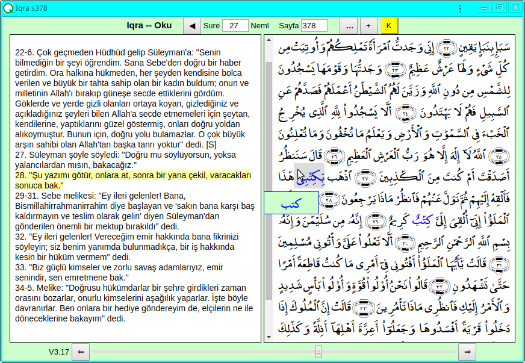
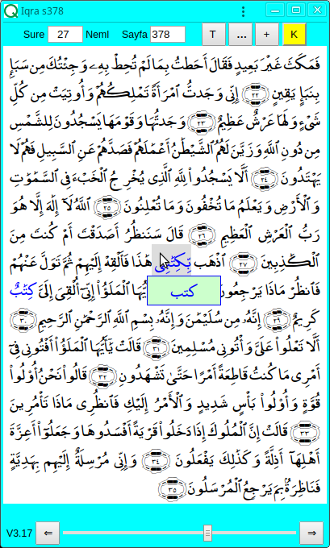
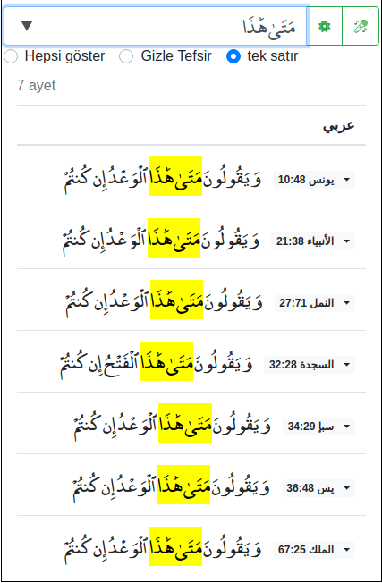
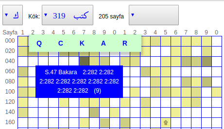
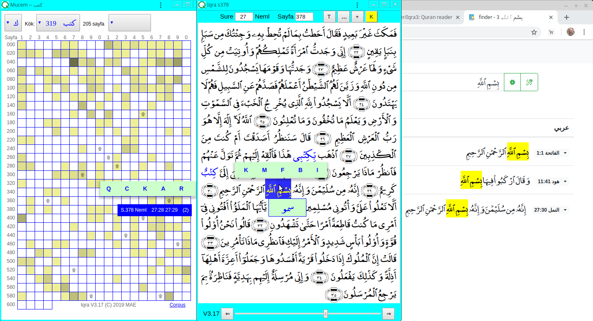

## Iqra V3.17

Iqra3, Kerim Kitabımız Kuran'ı okumak için yapılan yüzlerce yazılımdan biridir.

### 1. Sayfayı açmak ve çevirmek
Yazılımı başlatmak için üç farklı türden adres verebiliriz:

* [https://maeyler.github.io/Iqra3/reader](https://maeyler.github.io/Iqra3/reader) (yalın -- son kaldığı yerden devam eder)
* [https://maeyler.github.io/Iqra3/reader#p=378](https://maeyler.github.io/Iqra3/reader#p=378) (numarası verilen sayfadan)
* [https://maeyler.github.io/Iqra3/reader#v=27:28](https://maeyler.github.io/Iqra3/reader#v=27:28) (27. surenin 28. ayetinden)

Ekran yeteri kadar geniş ise hem Kuran sayfası hem de meali görünür. Sayfa açılınca, sonraki ya da önceki sayfaya geçmek, başka bir sure ya da sayfa numarası vermek mümkün. Sağ üstte görünen tuşların anlamı:

* T - Meal göster/gizle (sadece dar ekranda)
* … - Aynı sayfayı dış kaynaklarda aç
* \+ - Geçici bir büyüteç göster/gizle
* K - Arapça kelime köklerini göster/gizle

Sayfanın adresinde yazılan numaradan sonra, `&r=ktb` şeklinde kelime kökleri verilirse, bu kelimeler renkli gösterilir. Mucem'de seçilen kelimeler bu şekilde renklendiriliyor.

Bu ekranı görmek için gereken adres: [https://maeyler.github.io/Iqra3/reader#v=27:28&r=ktb](https://maeyler.github.io/Iqra3/reader#v=27:28&r=ktb)

Dar ekranlarda, ayetin anlamını görmek için T tuşuna basmak gerekiyor. Fontlar ekran genişliği ile orantılı olduğundan, telefonu yan tutmak daha iyi görüntü verecektir.

### 2. Arama motorları
Yazılım üç türlü aramayı destekliyor:

1. Düz metin ara (üç dilde)
2. Arapça kelimenin kökü ile ara
3. Ayete kelime bazında benzeyen ayetleri ara

### 2.1 Finder (Üç dil)
Arapça metin ya da meal içinde düz metin aramak için A. Rajab tarafından bitirme proje olarak hazırlanıyor (Bitiş tarihi: 2020 Mayıs)

Arapça-Türkçe-İngilizce sesli arama özelliği eklendi (Ayrıntılar ilgili sayfada açıklanacak)

### 2.2 Mucem (sadece Arapça)
Seçilen Arapça kelimelerin köküne bağlı bu arama yöntemi Kuran dilini bilenler ya da öğrenmek isteyenler için tasarlandı. Bu sayfada görülen 604 kutunun herbiri Kuran'dan bir sayfa. Aranan kök beyaz sayfalarda hiç yok. Her kutunun rengi, ilgili sayfada bulunan kelime sayısı ile orantılı.

**Ayrıntılar [ilgili sayfada](guideM.md)**

### 2.3 Benzer ayetler
(Bu kısım henüz yapılmadı)

### 3. Yazılımın yetenekleri
PWA (web application) olduğu için taşıdığı özellikler:

* Web sayfasından açılınca bileşenleri otomatik indirilir
* Güncelleme gerekmez, yeni sürümler otomatik indirilir
* Bir uygulama gibi, kendi penceresinde açılabilir
* Internet bağlantısı olmadan off-line çalışabilir
* Masa-üstü ekranlarından telefona kadar her boya uyumludur

Yazılımı üç pencere aynı anda açık iken kullanmayı tavsiye ediyoruz. Geniş ekranlarda mouse ile, dar ekranlarda adres çubuğunu kaydırarak pencereler arası geçiş sağlanıyor. Aşağıdaki üç pencere üstünde yazılımın yeteneklerini özetleyelim:

* Mucem: Gösterilen **ktb** (kef-tâ-bâ) kökünün muhtelif türevleri 319 kere, 205 sayfada geçiyor. Resimde seçilen 378. sayfada iki kere, daha koyu sayfalarda ise daha çok geçiyor. Arama konusu ayetleri, mavi alana tıklayarak Iqra'da, harflere tıklayarak dış kaynaklarda okuyabiliriz. Sağ alt köşedeki Corpus linkinden kullandığımız referans sayfaya ulaşılır.

* Iqra: Açık olan 378. sayfada "bismillah" kelimesi seçilmiş. K tuşu renkli olduğundan, imleçin üstünde olduğu kelimenin kökü **smw** (sin-mim-vav) görülüyor. Ayrıca, bağlam menüsünden üç türlü arama motoruna geçilebilir: M - Mucem, F - Finder, B - Benzer.

* Finder: Resimde "bismillah" harf dizisinin bulunduğu üç ayet görülüyor. Ayet numarasına basarak Iqra'ya dönmek ya da menüden dış yazılıma geçmek mümkün.

### 4. Yazılımın tarihçesi
(Bu kısım henüz yazılmadı)

